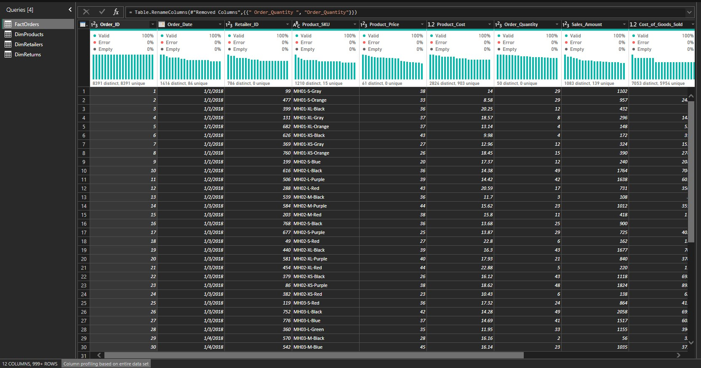
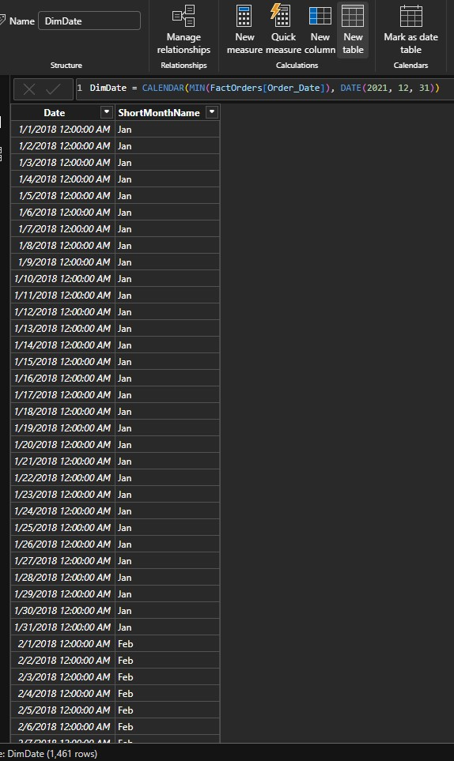
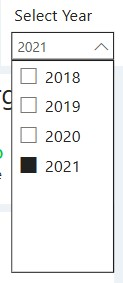
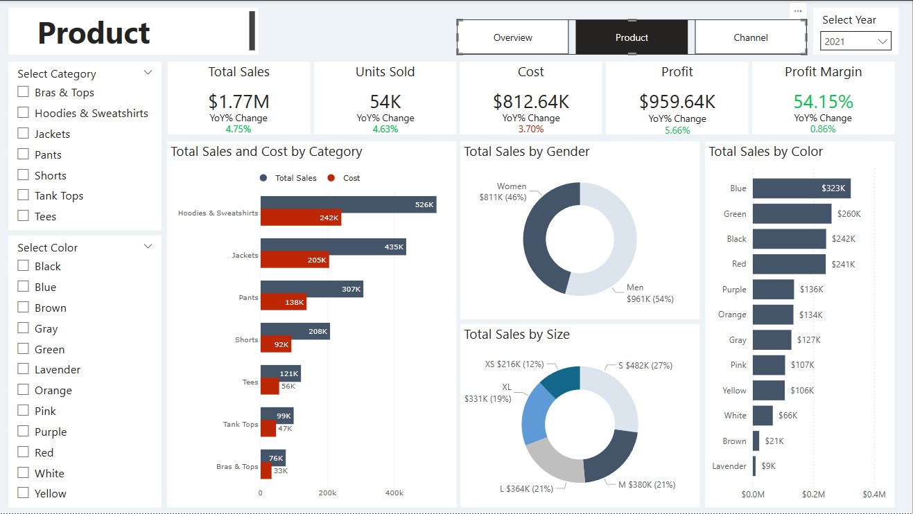
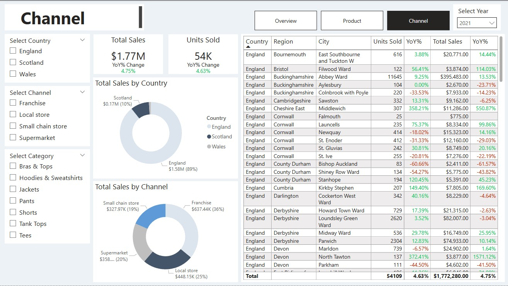

# Threads Ltd - Sales Report

### Overview
This report focuses on Threads Ltd (alias), a company that operates across the island through a network of retailers and chain stores. The dataset for this report was sourced from DataCamp and includes the following tables:

- **Orders Table**: Contains sales data such as sales, cost of goods sold (COGS).
- **Returns Table**: Lists products that have been returned.
- **Products Table**: Details of each product type.
- **Retailers Table**: Details of the retailers that ordered the products.

### Data Preparation
1. **Loading and Cleaning Data**
   - Loaded the dataset into Power BI Desktop.
   - Inspected and cleaned each table to remove duplicates and errors. Ensured there were no outliers in the table.
   - Identified the Orders Table as the fact table.

   

2. **Creating Dimension Date Table**
   - Created a dimension date table to utilize time intelligence functions in DAX.
   - Ensured continuous data display even if the fact table lacked data for every day.
   - Established relationships between tables in the data model.

   
   

### Report and Visualization
1. **Overview Page**
   - Displays total revenue, total units sold, total profit, profit margin by year, and Year-over-Year (YoY) % Change.
   - Includes charts for total revenue by month, total revenue by country and channel, and total revenue and profit by category.
   - Annual sales can be filtered by year.

   
   

2. **Product Page**
   - Provides details about the products sold by Threads Ltd.
   - Shows total sales, units sold, cost, profit, profit margin, and YoY % Change.
   - Allows filtering by product category.

   

3. **Channel Page**
   - Displays sales details by country and channel.
   - Includes a table showing total sales by country, region, and city, along with sales trends.
   - Filters available for country, channel, and category.

   

### Conclusion
You can download the Power BI report (`.pbix` file) for more detailed insights. Thank you for reviewing this report.
