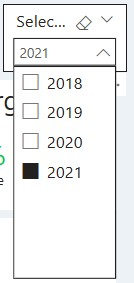

# 📊 Threads Ltd - Sales Report

This report provides a **comprehensive analysis** of the sales data for **Threads Ltd**, a nationwide retail network operating through various retailers and chain stores. Leveraging **Power BI**, this analysis uncovers key sales trends, supports strategic decision-making, and drives improved profitability and operational efficiency.

---

## 📌 Table of Contents
1. [Introduction](#introduction)  
2. [Dataset Overview](#dataset-overview)  
3. [Data Preparation](#data-preparation)  
   - [Loading and Cleaning Data](#loading-and-cleaning-data)  
   - [Creating a Dimension Date Table](#creating-a-dimension-date-table)  
   - [Data Model Relationships](#data-model-relationships)  
4. [Report and Visualization](#report-and-visualization)  
   - [Overview Page](#overview-page)  
   - [Product Page](#product-page)  
   - [Channel Page](#channel-page)  
5. [Key Findings & Insights](#key-findings--insights)  
6. [Business Impact & Decision Support](#business-impact--decision-support)  
7. [How to Use This Project](#how-to-use-this-project)  
   - [Power BI Report](#power-bi-report)  
   - [Using Cleaned Data](#using-cleaned-data)  
8. [Future Work & Improvements](#future-work--improvements)  
9. [References](#references)  

---

## Introduction
This report focuses on analyzing the sales data of **Threads Ltd**, a company operating through a network of retailers and chain stores across the country. The goal is to identify sales patterns, evaluate the performance of various sales channels, and recommend strategies for enhancing overall profitability.

---

## Dataset Overview
The dataset provides valuable insights into:
- **Sales performance**
- **Profitability trends**
- **Market dynamics**

**Tables Included**:
- **Orders Table**: Contains sales data, including total sales and cost of goods sold (COGS).
- **Returns Table**: Lists returned products.
- **Products Table**: Provides detailed information on each product type.
- **Retailers Table**: Offers insights into the retailers placing orders.

---

## Data Preparation

### Loading and Cleaning Data
- Imported the dataset into **Power BI Desktop**.
- Inspected each table and removed duplicates, outliers, and errors.
- Standardized data types and renamed tables for clarity.
- Designated the **Orders Table** as the primary fact table.

### Creating a Dimension Date Table
- Developed a **dimension date table** to leverage **time intelligence functions** in DAX.
- Ensured continuous date ranges, even if no transactions occurred on specific days.

### Data Model Relationships
- Established robust relationships among tables to create a cohesive data model.

> 

---

## Report and Visualization

### Overview Page
- **Key Metrics**: Displays total revenue, total units sold, total profit, profit margin by year, and YoY % Change.
- **Visualizations**: Includes monthly revenue trends, revenue distribution by country and sales channel, and profitability analysis by product category.
- **Filters**: Users can filter the sales data by year.
  
**Additional Explanation**:  
The Overview Page provides a high-level summary of the company's overall sales performance. It is designed to give stakeholders an immediate snapshot of how the business is performing, highlighting growth trends and potential areas for further analysis. This page is ideal for executive review and strategic planning.

>   
> 

### Product Page
- **Product Insights**: Displays key metrics such as total sales, units sold, cost, profit, profit margin, and YoY % Change by product category.
- **Filtering Options**: Enables users to drill down into specific product categories to analyze performance in detail.

**Additional Explanation**:  
The Product Page offers detailed insights into the performance of individual product categories. This page helps identify which products are driving revenue and profitability and which may require additional marketing or operational adjustments. It is particularly useful for product managers and marketing teams who need to understand product-level dynamics.

> 

### Channel Page
- **Sales Performance by Geography**: Presents sales data segmented by country, region, and city.
- **Sales by Channel**: Breaks down sales across various channels (e.g., Online, Retail, Wholesale) with interactive filtering options.
- **Detailed Breakdown**: Includes tables and charts that allow users to view performance by specific channels and geographic areas.

**Additional Explanation**:  
The Channel Page is designed to assess the effectiveness of different sales channels and geographic regions. By analyzing this data, decision-makers can pinpoint which channels and regions are most profitable and where there may be opportunities for growth or improvement. This page supports targeted marketing strategies and optimized distribution planning.

> 

---

## Key Findings & Insights
- **Top-Selling Products & Categories**: Identification of best-performing products and highly profitable categories.
- **Channel Effectiveness**: Analysis of which sales channels yield the highest returns.
- **Impact of Returns**: Evaluation of how product returns affect overall profitability.
- **Descriptive Statistics**: Preliminary analysis shows average monthly sales and variability, indicating market volatility that may impact inventory and pricing strategies.

*Interpretation*:  
- The data suggests that certain regions and product categories outperform others, guiding targeted marketing efforts.
- High return rates in specific channels indicate potential quality or service issues that warrant further investigation.

---

## Business Impact & Decision Support
This report is designed not only to provide a detailed analysis of sales data but also to serve as a strategic tool for business decision-makers. Here’s how it benefits various stakeholders:

- **Executive Overview**:  
  The report presents clear, high-level metrics (such as total revenue, profit margins, and YoY growth) that allow executives to quickly grasp the overall business performance and financial health.

- **Strategic Channel Evaluation**:  
  With detailed insights from the Channel Page, decision-makers can assess which sales channels (e.g., online, retail) are most effective, enabling them to allocate resources and adjust strategies for maximum impact.

- **Product Performance Analysis**:  
  The Product Page offers granular insights into individual product categories. This information is critical for identifying top-performing products and determining areas that require strategic adjustments, such as inventory management or marketing focus.

- **Data-Driven Marketing Decisions**:  
  By highlighting key trends and regional performance metrics, the report guides marketing managers in targeting high-potential markets and optimizing promotional efforts based on solid data.

- **Cost Management and Profitability**:  
  The evaluation of returns and overall profitability helps in identifying cost inefficiencies and optimizing pricing or production strategies, ensuring that investments are directed toward the most profitable segments.

- **Forecasting and Long-Term Planning**:  
  The descriptive statistics and trend analyses provide a foundation for predictive analytics, assisting in forecasting future sales, managing inventory, and planning long-term business strategies.

Overall, this report equips business leaders with the actionable insights needed to drive strategic decisions, optimize operations, and improve overall business performance.

---

## How to Use This Project

### Power BI Report
1. Download the `threads_ltd_sales_report.pbix` file.
2. Open it using **Power BI Desktop**.
3. Interact with the dashboards to explore sales trends and performance metrics.

### Using Cleaned Data
- The cleaned data files (`factorders_clean.csv`, `dimreturns_clean.csv`, `dimretailers_clean.csv`, `dimproducts_clean.csv`, `dimdate_clean.csv`) can be imported into **Python**, **R**, or **SQL** for further analysis.

---

## Future Work & Improvements
- **Dataset Expansion**: Incorporate additional data such as customer demographics or market trends.
- **Predictive Analytics**: Develop machine learning models to forecast future sales and inventory needs.
- **Customer Sentiment Analysis**: Evaluate customer satisfaction through sentiment analysis to refine sales strategies.

---

## References
- [DataCamp Dataset](https://www.datacamp.com)  
- Research papers on **sales analytics**, **market trends**, and **retail strategies**.
