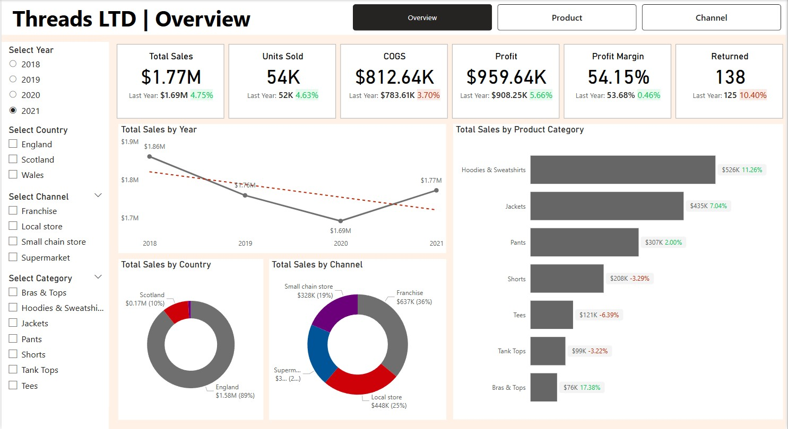
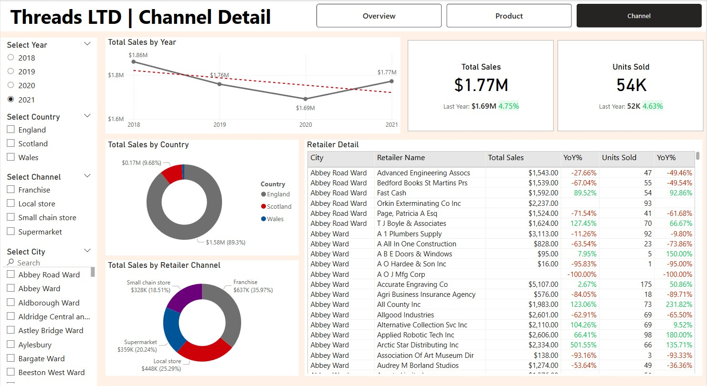

# 📊 Threads Ltd – Sales Report

This **Power BI** dashboard delivers an end‑to‑end analysis of **Threads Ltd**’s sales performance across its nationwide retail network. By combining data from orders, products, returns, and retailer tables, the report uncovers sales patterns, channel efficiencies, and profitability levers—empowering stakeholders to make data‑driven decisions.

---

### Project Architecture:
> 

## 📌 Table of Contents
1. [Introduction](#introduction)  
2. [Dataset Overview](#dataset-overview)  
3. [Data Preparation](#data-preparation)  
   - [Loading & Cleaning Data](#loading--cleaning-data)  
   - [Dimension Date Table](#dimension-date-table)  
   - [Data Model Relationships](#data-model-relationships)  
4. [Report & Visualization](#report--visualization)  
   - [Overview Page](#overview-page)  
   - [Product Page](#product-page)  
   - [Channel Page](#channel-page)  
5. [Key Findings & Insights](#key-findings--insights)  
6. [Business Impact & Decision Support](#business-impact--decision-support)  
7. [How to Use This Project](#how-to-use-this-project)  
8. [Future Work & Improvements](#future-work--improvements)  
9. [References](#references)  

---

## Introduction
The **Threads Ltd Sales Report** evaluates transaction data from multiple retailers and chain stores to:

- Identify year‑over‑year sales trends  
- Benchmark channel and product performance  
- Analyze profitability and cost structures  
- Support strategic planning with actionable insights  

---

## Dataset Overview
The analysis draws on four core tables:

| Table            | Key Columns                                                                                 |
|------------------|---------------------------------------------------------------------------------------------|
| **Orders**       | `order_id`, `order_date`, `retailer_id`, `product_sku`, `quantity`, `sales_amount`, `profit` |
| **Returns**      | `order_id`, `return_date`                                                                   |
| **Products**     | `product_sku`, `category`, `description`, `size`, `color`                                   |
| **Retailers**    | `retailer_id`, `channel`, `name`, `city`, `region`, `country`                               |

---

## Data Preparation

### Loading & Cleaning Data
- Imported source tables into **Power BI Desktop**.  
- Removed duplicates, nulls, and obvious data errors.  
- Standardized data types (dates, numeric fields) and renamed columns for clarity.

### Dimension Date Table
- Created a dedicated **Date** dimension to leverage DAX time‑intelligence functions (e.g., YTD, YoY).  
- Ensured complete date coverage—even on days without transactions.

### Data Model Relationships
- Established one‑to‑many relationships between **Orders** and all dimension tables (Date, Products, Retailers).  
- Configured return flags and calculated profit measures for accurate aggregations.

> 

---

## Report & Visualization

### Overview Page
- **KPIs**: Total Sales, Units Sold, Profit Margin, Year‑over‑Year % Change  
- **Visuals**:  
  - Line chart showing sales trends (2018–2021)  
  - Card visuals for key metrics  
  - Pie chart of sales by country  
- **Filter**: Year selector  
- **Purpose**: Provides an at‑a‑glance summary of overall performance and trend direction.

> 

---

### Product Page
- **Metrics**:  
  - Total Sales, Units Sold, Profit Margin by Category  
  - YoY % Change for each product line  
- **Visuals**:  
  - Bar chart of sales by category  
  - Trend line of annual sales  
  - Detail tables for size and color performance  
- **Filters**: Year, Gender, Category, Color  
- **Purpose**: Highlights top‑performing products and identifies categories needing targeted investment.

> 

---

### Channel Page
- **Metrics**:  
  - Total Sales & Units Sold with YoY comparison  
- **Visuals**:
  - Trend line of annual sales    
  - Donut charts for country & retailer channel breakdown  
  - Tables listing top‑performing retailer and growth rates  
- **Filters**: Year, Country, Channel, City  
- **Purpose**: Enables deep‑dive into geographic and channel performance—guiding market expansion and resource allocation.

> 

---

## Key Findings & Insights
- **Sales Trend**: After a dip in 2020, 2021 sales rebounded +4.75% to \$1.77M.  
- **Top Products**: Hoodies & Sweatshirts lead sales (\$526K, +11.3% YoY).  
- **Channel Leaders**: Franchises generate 36% of revenue; local stores at 25%.  
- **Geographic Hotspots**: England accounts for 89% of sales; Scotland and Wales together 11%.  
- **Profit Drivers**: High-margin products (Bras & Tops) show 17% YoY growth despite lower volumes.

---

## Business Impact & Decision Support
This dashboard equips leadership with:

- **Executive Summary**: Quick visibility into financial health and growth trends.  
- **Product Strategy**: Data‑backed identification of high‑margin categories for promotional focus.  
- **Channel Optimization**: Insights to reallocate budgets toward fastest‑growing channels and regions.  
- **Operational Efficiencies**: ROI analysis on store formats to inform network expansion or consolidation.  

---

## How to Use This Project

### Power BI Report
1. Download `threads_ltd_sales_report.pbix`.  
2. Open in **Power BI Desktop**.  
3. Use the navigation tabs and slicers (Year, Category, Country) to filter views.

### Access Cleaned Data
- CSV exports (`orders_clean.csv`, `products_clean.csv`, etc.) are available for advanced analysis in SQL, Python, or R.

---

## Future Work & Improvements
- **Real‑Time Data**: Integrate live sales feeds via Azure Data Factory.  
- **Predictive Analytics**: Implement forecasting models for next‑quarter sales projections.  
- **Enhanced UX**: Add drill‑through pages and mobile‑optimized layouts.  

---

## References
- **Dataset**: Internal Threads Ltd sales & returns data  
- **Methodology**: Power BI best practices 
- **Tools**: Power Query, DAX
